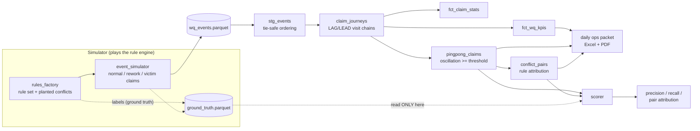
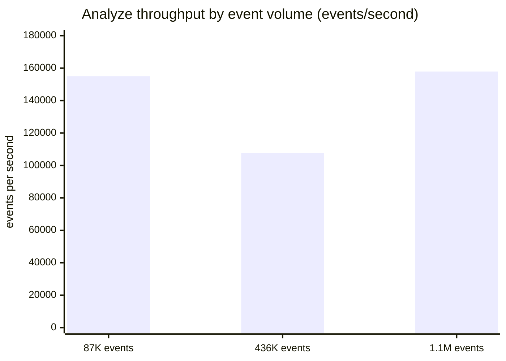

# workqueue-flow-radar

**Workqueue analytics that replays claim-edit WQ event logs to measure aging, touches, and first-pass yield, and detects ping-pong claims bouncing between queues under conflicting routing rules: 1.0 precision and 1.0 recall on labeled victims at every benchmarked volume, with the conflicting rule pair named from the event log alone.**


## What this solves

- Routing conflicts are invisible in queue views: two rules whose predicates overlap but route to different workqueues pull the same claim back and forth. Staff see a claim reappear; nobody sees the pair of rules causing it. In the shipped 20K-claim world, 54 victim claims burned 2,402 hours and 242 touches across two live conflicts.
- Manual morning reporting does not scale: the radar generates the daily ops packet (per-queue KPIs, aging percentiles, first-pass yield, deferral counts, a routing-conflict table with hours and touches wasted) as a formatted Excel workbook plus a one-page PDF.
- Naive cycle detection flags normal operations: a legitimate rework round trip (claim leaves for coding and comes back) is also A to B to A. The detector requires sustained oscillation, and the simulator plants hundreds of rework claims specifically to punish anything less careful.

## Executive summary

Hospital billing workqueues are where AR days hide. The native tooling answers "what is in this queue now" but not "how do claims MOVE through the queues", and the most expensive movement pattern is the ping-pong: a claim matching two conflicting routing rules oscillates between two queues, touched again and again by staff who each route it correctly by their own queue's rule. Rule sets accrete for years across analysts; nobody reads all of them at once.

This project treats WQ history as an event log (route_in, touch, defer, route_out, resolve, mirroring how it lands in a Clarity-style extract) and reconstructs claim journeys with SQL window functions. From journeys it derives the operational KPIs a morning huddle needs, then hunts oscillation: claims making 3 or more alternating transitions between the same two queues. Route_in events carry the rule that fired, so detected oscillation is attributed to the specific rule pair pulling in each direction, with the victim count, wasted hours, and wasted touches that make the fix a priority conversation instead of an argument.

A simulator makes the detector measurable. It builds a routing rule set with planted conflicting pairs, then runs claims through three populations: normal lifecycles, legitimate rework round trips (the false positive trap), and ping-pong victims. Ground truth goes to a file the radar never reads. Measured across seeds and volumes up to 1.1M events: claim-level precision 1.0, recall 1.0, and every fired conflict pair attributed to the correct two rules.

## Architecture



## Tech stack

| Technology | Role in this project | Why chosen here |
|---|---|---|
| Python 3.11+ | Simulator, orchestration, CLI | Right tool for stateful lifecycle simulation |
| DuckDB | Analytics engine | Window functions over a million events in seconds, zero infra |
| Plain .sql models | Journeys, KPIs, detection, attribution | The window-function logic IS the portfolio piece; reviewable and portable |
| openpyxl + reportlab | Daily ops packet (Excel + PDF) | The scheduled-report artifact ops actually consumes; SSRS note below |
| pandas + pyarrow | Event IO | Parquet in and out |
| pytest + pytest-cov | 12 tests, 95% measured coverage | Invariants: monotonic clocks, single resolve, rework never flagged |
| ruff + GitHub Actions | Lint and CI on 3.11/3.12 | Coverage floor enforced at 90% in CI |

## Quickstart

Prerequisites: Python 3.11+, pip.

```bash
git clone https://github.com/ManojKumarChunduru/workqueue-flow-radar.git
cd workqueue-flow-radar
pip install -e ".[dev]"
wq-radar all            # generate -> analyze -> report -> score
pytest                  # 12 tests
```

`wq-radar all` prints the detection scorecard as JSON and writes `output/wq-daily-ops-packet.xlsx`, `output/wq-daily-ops-summary.pdf`, and the analysis parquets. Knobs live in `config/settings.yaml` (env override: `WQ_RADAR__GENERATOR__N_CLAIMS=100000`). Or run `scripts/demo.sh`.

To analyze real WQ history: shape the extract to the event schema (claim_id, event_time, event_type, wq_id, user_id, rule_id) as parquet, point `paths.events_file` at it, and run `wq-radar analyze report`.

## The SSRS note

The daily packet is the role SSRS plays in most hospital reporting stacks: a scheduled operational report distributed as a file. This repo ships the file generator first because it needs no serving surface, and the analysis views (`fct_wq_kpis`, `pingpong_claims`, `conflict_pairs`) are deliberately clean SSRS or Power BI sources: point a report at the parquets (or load them to SQL Server) and the packet becomes a subscription. What this repo does not do is pretend a checked-in .rdl is a working report; the honest deliverable is the data contract plus a generator that proves it renders.

## Performance under load

Methodology: `python benchmark/run_benchmark.py` runs simulate, analyze, packet render, and score at three volumes. Throughput is events per second over the analyze step (load, six SQL models, result extraction); simulation is excluded because production events arrive from the EHR's WQ history. Container: 1 vCPU, 3.9 GB RAM, Linux, Python 3.12, DuckDB 1.5.x. Raw output with machine context: `benchmark/results/`.



| Claims | Events | Analyze s | Events/s | Packet s | Precision | Recall |
|---:|---:|---:|---:|---:|---:|---:|
| 20,000 | 87,185 | 0.562 | 155,002 | 0.082 | 1.0 | 1.0 |
| 100,000 | 435,972 | 4.043 | 107,842 | 0.261 | 1.0 | 1.0 |
| 250,000 | 1,088,185 | 6.892 | 157,881 | 0.184 | 1.0 | 1.0 |

The mid-volume dip is real and repeatable on this container; the honest reading is that throughput sits between 100K and 160K events/second across the range rather than a smooth curve, and a year of WQ history for a large hospital analyzes in seconds either way. Detection quality also held at 1.0 precision and recall across a six-seed sweep at 12K claims each, which matters more than the shipped seed's numbers.

A note on the perfect scores: the simulator's conflicts produce sustained oscillation (3+ transitions) while its rework claims produce exactly one round trip, so the threshold separates them cleanly. Real WQ history is messier: a conflict interrupted by a supervisor after one bounce is indistinguishable from rework in the event log, and the README of the rule set, not the radar, is what prevents that case. The `min_oscillations` knob is the precision/recall dial, and the honest field advice is to start at 3 and review the hotlist weekly.

## Architecture decisions

Two ADRs in [`docs/adr/`](docs/adr/):

- [ADR-0001](docs/adr/0001-event-sourcing-over-state-snapshots.md): reconstruct journeys from the event log with window functions, over storing per-claim state.
- [ADR-0002](docs/adr/0002-behavioral-detection-over-static-analysis.md): detect conflicts from observed behavior, over static rule-predicate intersection analysis, and what dormant conflicts mean for that choice.

## Intentionally out of scope

No intra-day streaming. WQ ops runs on a daily rhythm (morning huddle, end-of-day counts), so daily batch replay is the honest cadence. Trigger for revisiting: an ops requirement to catch ping-pong within hours of onset, at which point the event loader becomes incremental and the oscillation check windows over a rolling horizon; the SQL models do not change.

## Security and compliance

- Every row is synthetic. No PHI, no real patient, payer, staff, or rule data anywhere in this repository.
- Real WQ event logs contain user_ids, which are workforce data: the packet aggregates users to counts per queue and never ranks individuals, a deliberate choice because productivity leaderboards derived from touch events are how analytics tools lose staff trust.
- The tool reads local files and writes local files; no network, no credentials.
- Nothing sensitive is logged: log lines carry counts, queue ids, and timings, never claim content.

## Failure modes

| Failure | Detection | Behavior | Recovery |
|---|---|---|---|
| Events file missing | Loader checks existence | Fails fast, names the file and the generate command | Run `wq-radar generate` or point at a real extract |
| Claim with no resolve event | Journey view falls back to last route_in span | Visit hours computed to the last known event; claim shows as unresolved in stats | Expected for open claims in real extracts |
| Timestamp ties within a claim | Staging orders by (event_time, event_id) | Deterministic journeys regardless of tie order in the source | None needed; by design |
| Non-integer oscillation threshold | Type check before SQL render | Raises TypeError; nothing executes | Fix the config value |
| Findings volume explodes | Packet sheets truncate at 500 rows | Sheet notes the truncation; parquets hold the full set | Work from the parquets |

## Hardest problem solved

The bug that wasn't. On the default seed, one of the three planted conflict pairs produced zero victim claims. That looked like a simulator defect: the pair's predicate matched 86 claims, so where were the oscillations?

Tracing those 86 claims through rule evaluation gave the answer: every one of them was captured first by a higher-priority plain rule (R006 took 74, two others took the rest). The conflicting pair was **shadowed by precedence**: both rules live, both wrong together, and neither ever fires. This is exactly how real rule sets carry dormant conflicts for years, until someone retires the shadowing rule and the ping-pong starts "out of nowhere".

The finding reshaped the scorer rather than the simulator: pairs are now scored as fired, attributed, or **dormant**, and dormant pairs count against nothing, because a behavioral detector cannot see a conflict that produced no behavior. It also wrote ADR-0002's limitation section for me: behavioral detection finds every conflict that costs you money today, and only static predicate analysis (the documented follow-on) can find the ones waiting to. The lesson: when a planted signal fails to appear, the explanation is sometimes the most realistic thing your simulation does.

## Future work

- Static rule-pair predicate intersection analysis, the complement ADR-0002 commits to: find dormant conflicts before they fire.
- Rolling-window incremental analysis for the intra-day trigger in the pivot.
- Aging-based WQ load forecasting from the journey data (arrivals minus resolutions per queue).
- An anonymization pass (hash user_ids and claim_ids) so real extracts can be analyzed on shared infrastructure.
- First metric to watch in production: new (wq_x, wq_y) pairs appearing in the hotlist, the early signal of a rule change gone wrong.

## License

MIT
